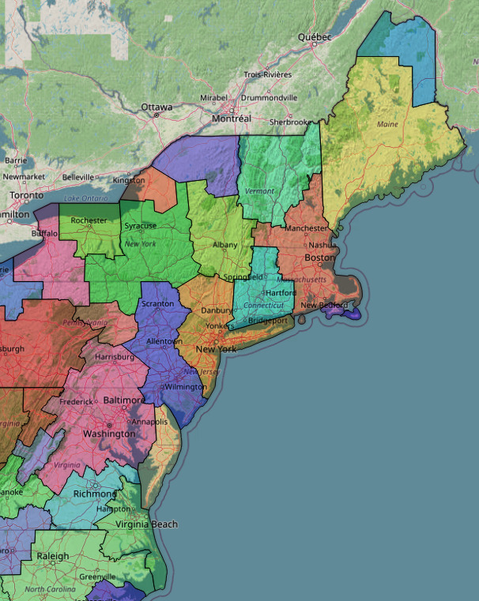
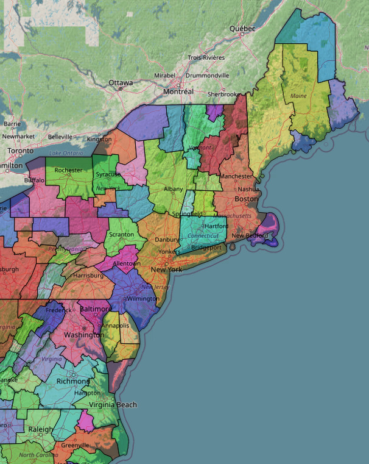
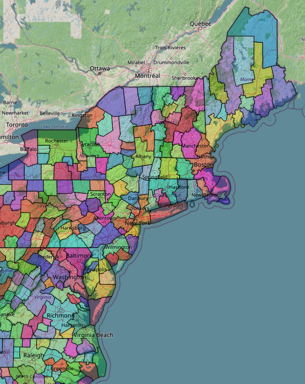
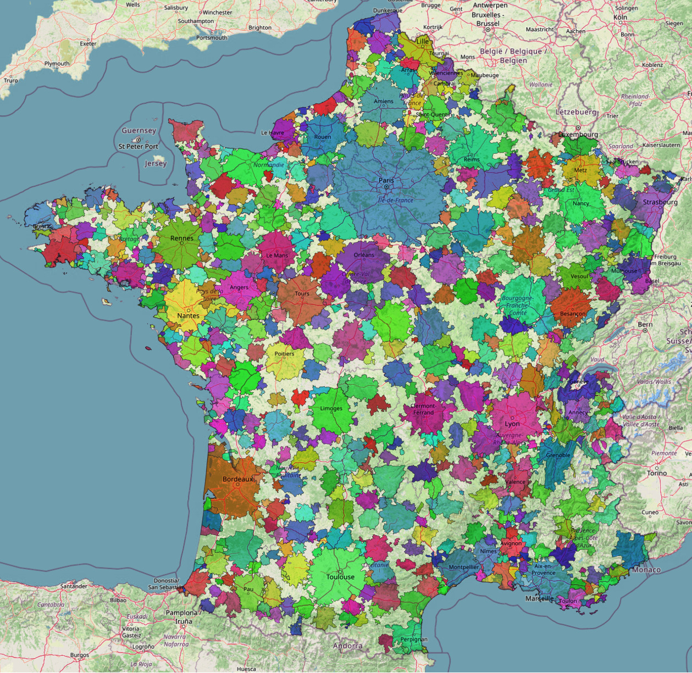
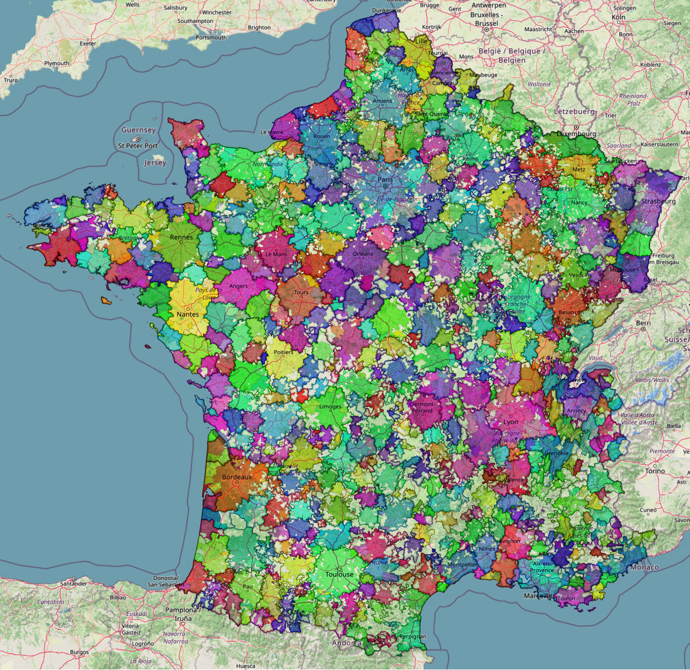
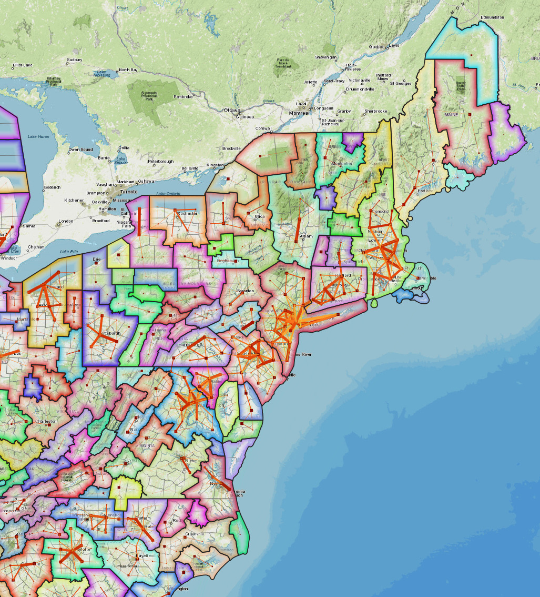
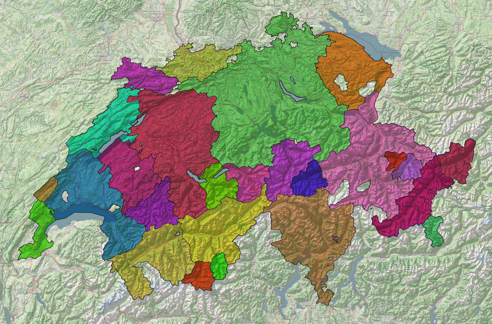
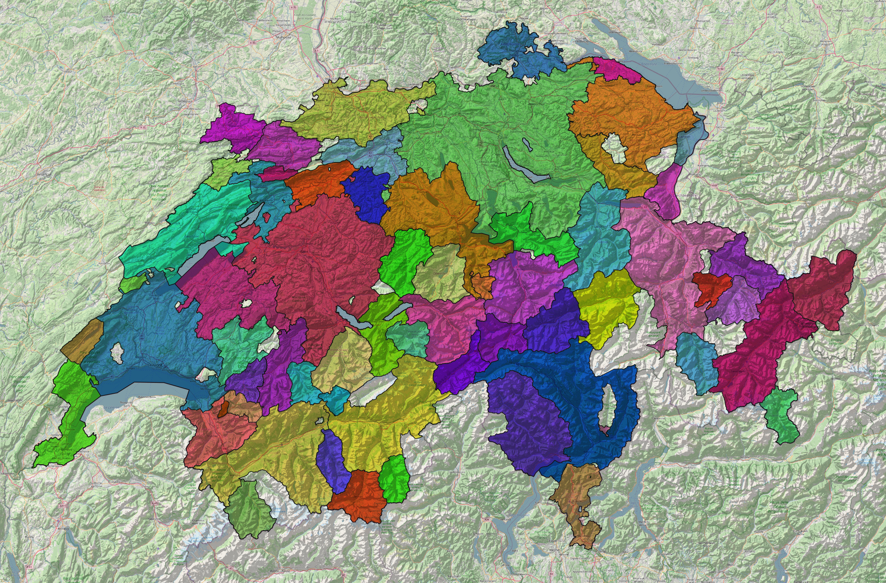
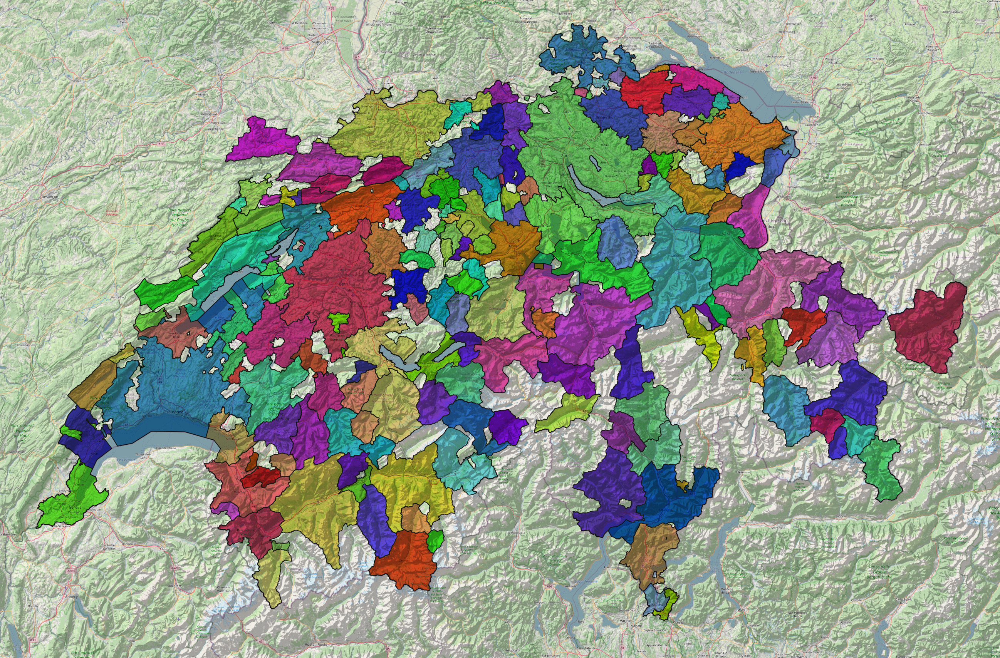

<p align="center">
    
    
    
    <i>Centers detected from commuting flows in the Northeastern USA, at center levels 10, 7 and 4 (from left to right).</i>
</p>

<h1 align="center">Hierarchical Urban Systems</h1>


[](https://doi.org/10.5281/zenodo.14609163)

<h2>Table of Contents</h2>

- [Overview](#overview)
- [Introduction](#introduction)
- [Algorithm](#algorithm)
- [Getting Started](#getting-started)
- [How to Use](#how-to-use)
  - [Detecting centres on local data](#detecting-centres-on-local-data)
  - [Detecting centres on custom data](#detecting-centres-on-custom-data)
- [Citing this repository](#citing-this-repository)
- [Gallery](#gallery)
- [Credits](#credits)
  - [References](#references)
  - [Data Sources](#data-sources)

## Overview

We propose a novel approach to detecting and characterizing urban areas. Our algorithm produces a hierarchical assignment of the nodes in a commuting system, thus representing urban regions as the union of smaller local centres. This approach has proved experimentally robust on commuting datasets from different countries using different administrative systems.

In this repository, you will find:
 - The complete source code of a memory-efficient implementation of our algorithm.
 - Commuting data sources from various countries, used for development and readily available. The countries are France, Belgium, Italy, Switzerland, and the United States. The raw data as well as the scripts used to format it are also present.
 - Up-to-date examples on how to use the algorithm in this repository to detect hierarchical urban systems in either custom or provided commuting data.
 - A detailed walk through the concepts and method used by our algorithm (link [here](docs/ALGORITHM.md)).
 - Tests and CI elements of the various components of this repository.

## Introduction

Modern cities exert influence over vast areas surrounding the core centre, leading to the establishment of vast urban regions. Due to the relatively recent emergence of these regions, their extent often reaches far beyond the administrative limits of the urban cores [(Cardoso et al., 2021)](#Cardoso2021). Furthermore, urban regions are not consistently represented and characterized between countries, leading to challenges in comparison and governance. Determining the boundaries of these urban regions is thus of particular interest.

The movement of goods and people is an actively explored source to delineate the boundaries of urban regions. By capturing the exchanges between residential, working and commercial places, it is possible to highlight hubs of intense attractivity. The combination of these areas of high attractivity with their dependent areas allows for the definition of individual Functional Urban Regions. By focusing on where people interact and move to the most, FUR allow for the identification of typical urban structures, as well as that of complex, polycentric systems. A popular approach to define these areas is through commuting flows [(Moreno-Monroy et al., 2021)](#Moreno-Monroy2021) [(Bosker et al., 2021)](#Bosker2021) [(Duranton et al., 2015)](#Duranton2015), but other sources such as cellphone data have been explored [(Chen et al., 2022)](#Chen2022). One notable method is the definition of Functional Urban Areas [(Dijkstra et al., 2019)](#Dijkstra2019), which delimits urban regions by identifying commuting zones around densely populated urban cores. This definition has been adopted by the OECD and by some of its member countries as the standard for characterizing urban areas.

While a large body of work is devoted to determining the boundaries of an urban region, so far the characterization of these regions' structures is not a well-explored topic. Urban regions are heterogeneous in nature, comprising extensive interactions between fundamentally different entities, from dense urban cores to suburban areas, and secondary cities to rural places [(Hall et al., 2013)](#Hall2013). Despite belonging to the same urban region, such spaces all present their own challenges and economic disparities that need to be addressed through effective governance [(Qian et al., 2020)](#QIAN2020) [(Band et al., 2005)](#BAND2005). As such, characterizing the underlying structures of urban regions is key to their understanding.

In this repository, we propose a novel method aimed at characterizing these structures. Our algorithm uses only commuting flows between the various nodes (typically administrative units) of a system. It works by first finding the centres that best represent local commuting flows. We then iteratively merge these centres based on their indirect commuting flows, which grow in scope at every step. The end result is a levelled centre assignment for every node, where the lower levels represent local centres and the higher levels represent wider urban regions. Urban regions are thus built as hierarchical systems, describing a wider zone of interaction between local systems.

Our method works by finding the best fitting centre for every previously detected centre at every step. It is parameterless, ensuring adaptability to different datasets. It has proved experimentally robust on commuting datasets originating from various countries using significantly different administrative structures. Our contributions are the following:

 * A flexible and parameter-less algorithm, able to detect urban systems of any size, relying only on commuting data.
 * A cohesive hierarchical structure detailing the relationship of smaller centres to larger urban systems.
 * Comparable results across commuting systems of different structures between different countries, at the same assignment level.
 * A novel metric to measure the cohesion and representation of nodes in their clusters.
 * An efficient algorithm implementation leveraging the inherent sparsity of commuting flow matrices, making it possible to process very large node networks.

<p align="center">
    
    
</p>
<p align="center" style="margin-left:5%;margin-right:5%;">
    <i>Urban Systems in metropolitan France, following the OECD definition of Functional Urban Areas (left) and by our approach at center level 3 and 5 (right). Since our approach does not rely on density criteria, it is able to identify centers in rural areas, as well as in highly polycentric urban systems. Furthermore, large urban areas such as Paris (center-north) and Lyon (center-east) are decomposed according to the distinct, interconnected cities making up the urban region.</i>
</p>


## Algorithm

The details of the algorithm as well as the concepts used to elaborate it can be found [here](docs/ALGORITHM.md).

## Getting Started

Clone the repository locally into an appropriate folder.

```bash
git clone https://github.com/TheFamousRat/HierarchicalUrbanSystems.git
```

You can then move into the downloaded folder by running

```bash
cd HierarchicalUrbanSystems
```

The Python dependencies are defined in the [pyproject.toml](pyproject.toml). We recommend the use of `poetry` to install the dependencies. If you do not yet have `poetry`, please follow the link here for installation instructions: https://python-poetry.org/docs/main/#installing-with-the-official-installer.

Once poetry has been installed, simply run 

```bash
poetry install
```

to install the dependencies cached in `poetry.lock`. This step will create a virtual environment for the project. You can activate it by running:

```bash
source .venv/bin/activate
```

If all the steps above worked successfully, it should be possible to interact with the code directly. Running one of the example files would then be done like so

```bash
python hierarchical_urban_systems/examples/detect_and_save_centers_assignment_switzerland.py 
```

## How to Use

We provide examples on various use cases for our algorithm. Please refer to them if you want to get started in using this repository in a project. To ensure that these examples stay up-to-date, we do not include them directly in this README, please find them in the examples folder (link [here](hierarchical_urban_systems/examples)).

### Detecting centres on local data

This repository already contains datasets of the commuting flows from various countries. An example on how to read one such dataset, extract centers from it and save them locally can be found [here](hierarchical_urban_systems/examples/detect_and_save_centers_assignment_switzerland.py). 

### Detecting centres on custom data

It is also of course possible to use the algorithm with custom data. The only required input to the algorithm is a sparse matrix containing the flows between the nodes. It is also possible to provide information on the nodes, such as the postal code or name of the unit they correspond to. We provide an example of how to extract and save centres from such flows [here](hierarchical_urban_systems/examples/detect_centers_in_custom_flows.py).

## Citing this repository

If this repository has been helpful to you, please cite it. We have included a [CITATION.cff file](CITATION.cff) for a recommended citation style as well as relevant information regarding this codebase. A citation can directly be obtained and copied to the clipboard in APA or BibTeX format by clicking **"Cite this repository"** on this repository's sidebar. Find more information on Github citations [here](https://docs.github.com/repositories/managing-your-repositorys-settings-and-features/customizing-your-repository/about-citation-files).

## Gallery

<p align="center">
    
</p>
<p align="center">
    <em>Northeast United States, centers of level 7 with commuter flows.</em>
</p>

<p align="center">
    
    
    
    <i>Centers detected from commuting flows in Switzerland, at center levels 7, 5 and 3 (from left to right).</i>
</p>

## Credits

### References

<a id="Hall2013"></a>
HALL, Peter. Looking backward, looking forward: The city region of the mid-21st century. In : The futures of the city region. Routledge, 2013. p. 15-29.

<a id="Dijkstra2019"></a>
DIJKSTRA, Lewis, POELMAN, Hugo, et VENERI, Paolo. The EU-OECD definition of a functional urban area. 2019.

<a id="Moreno-Monroy2021"></a>
MORENO-MONROY, Ana I., SCHIAVINA, Marcello, et VENERI, Paolo. Metropolitan areas in the world. Delineation and population trends. Journal of Urban Economics, 2021, vol. 125, p. 103242.

<a id="Bosker2021"></a>
BOSKER, Maarten, PARK, Jane, et ROBERTS, Mark. Definition matters. Metropolitan areas and agglomeration economies in a large-developing country. Journal of Urban Economics, 2021, vol. 125, p. 103275.

<a id="Chen2022"></a>
CHEN, Zifeng et YEH, Anthony Gar-On. Delineating functional urban areas in Chinese mega city regions using fine-grained population data and cellphone location data: A case of Pearl River Delta. Computers, environment and urban systems, 2022, vol. 93, p. 101771.

<a id="Duranton2015"></a>
DURANTON, Gilles. A proposal to delineate metropolitan areas in Colombia. Desarrollo y Sociedad, 2015, no 75, p. 223-264.

<a id="Cardoso2020"></a>
CARDOSO, Rodrigo et MEIJERS, Evert. The process of metropolization in megacity-regions. In : Handbook of megacities and megacity-regions. Edward Elgar Publishing, 2020. p. 360-375.

<a id="Cardoso2021"></a>
CARDOSO, Rodrigo et MEIJERS, Evert. Metropolization processes and intra-regional contrasts: The uneven fortunes of English secondary cities. In : Secondary Cities. Bristol University Press, 2021. p. 103-132.

<a id="Derudder2022"></a>
DERUDDER, Ben, MEIJERS, Evert, HARRISON, John, et al. Polycentric urban regions: Conceptualization, identification and implications. Regional Studies, 2022, vol. 56, no 1, p. 1-6.

<a id="GLAESER2011"></a>
GLAESER, Edward. Cities, productivity, and quality of life. Science, 2011, vol. 333, no 6042, p. 592-594.

<a id="BAND2005"></a>
BAND, Larry E., CADENASSO, Mary L., GRIMMOND, C. Susan, et al. Heterogeneity in urban ecosystems: patterns and process. Ecosystem function in heterogeneous landscapes, 2005, p. 257-278.

<a id="QIAN2020"></a>
QIAN, Yuguo, ZHOU, Weiqi, PICKETT, Steward TA, et al. Integrating structure and function: Mapping the hierarchical spatial heterogeneity of urban landscapes. Ecological Processes, 2020, vol. 9, p. 1-11.

<a id="Ahrend2015"></a>
Rudiger Ahrend, Emily Farchy, Ioannis Kaplanis, Alexander C. Lembcke WHAT MAKES CITIES MORE PRODUCTIVE? EVIDENCE ON THE ROLE OF URBAN GOVERNANCE FROM FIVE OECD COUNTRIES

<a id="Nelles2013"></a>
NELLES, Jen. Cooperation and capacity? Exploring the sources and limits of city‐region governance partnerships. International Journal of Urban and Regional Research, 2013, vol. 37, no 4, p. 1349-1367.


### Data Sources

 - **France** : INSEE, Mobilités professionnelles en 2020 : déplacements domicile - lieu de travail, https://www.insee.fr/fr/statistiques/7630376
 - **Belgium** : Statbel, Census 2011 - Matrice des déplacements domicile-travail par sexe, https://statbel.fgov.be/fr/open-data/census-2011-matrice-des-deplacements-domicile-travail-par-sexe
 - **Switzerland** : Federal Statistical Office, Employed persons by commune of residence and work, 2014, 2018 and 2020, https://www.bfs.admin.ch/asset/en/27885394
 - **Italy** : Istat, Matrici del pendolarismo 2011, https://www.istat.it/non-categorizzato/matrici-del-pendolarismo/
 - **United States** : United States Census, 2016-2020 5-Year ACS Commuting Flows, https://www.census.gov/data/tables/2020/demo/metro-micro/commuting-flows-2020.html


