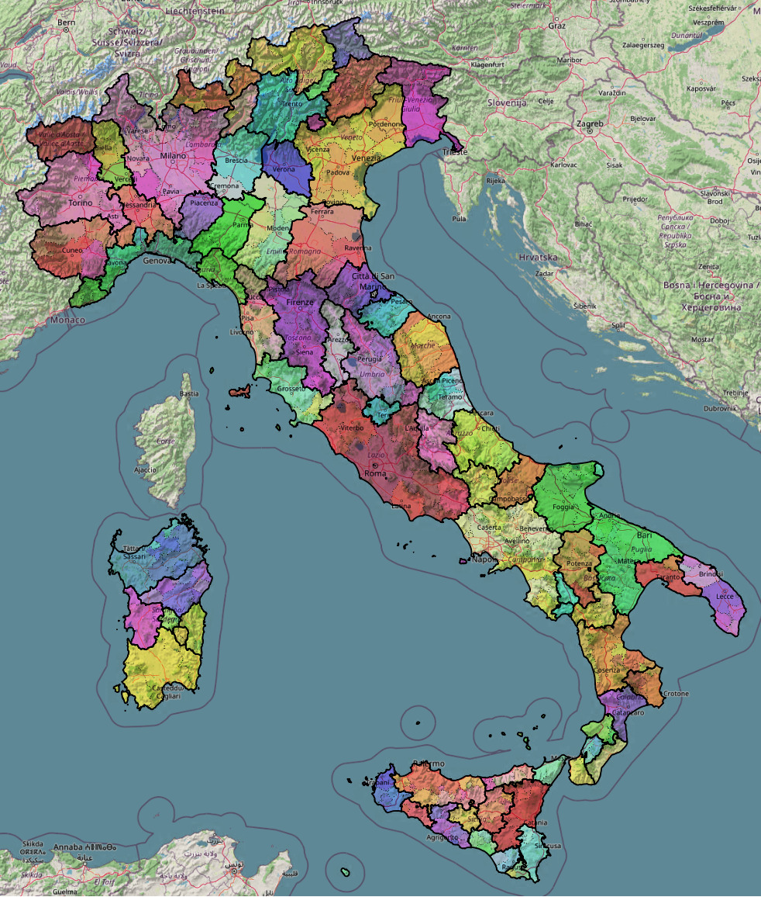
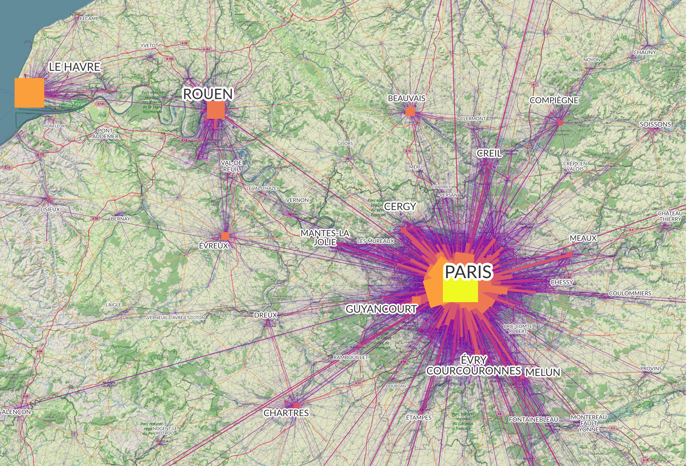
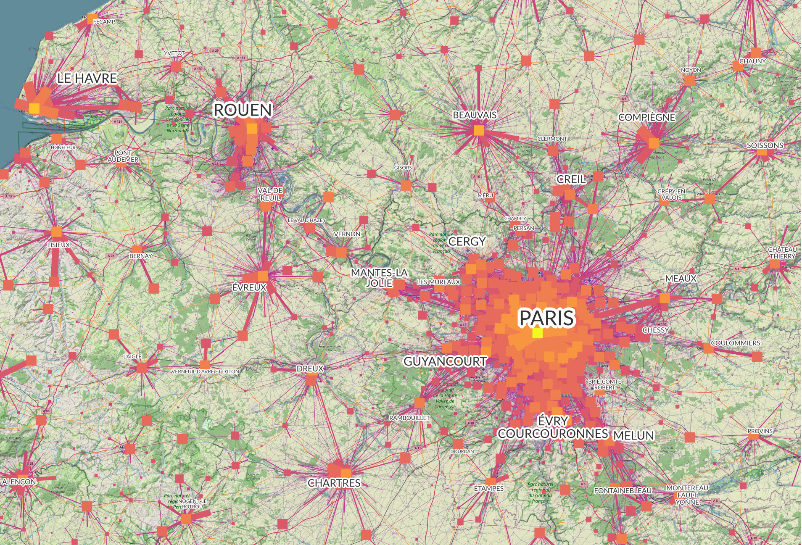
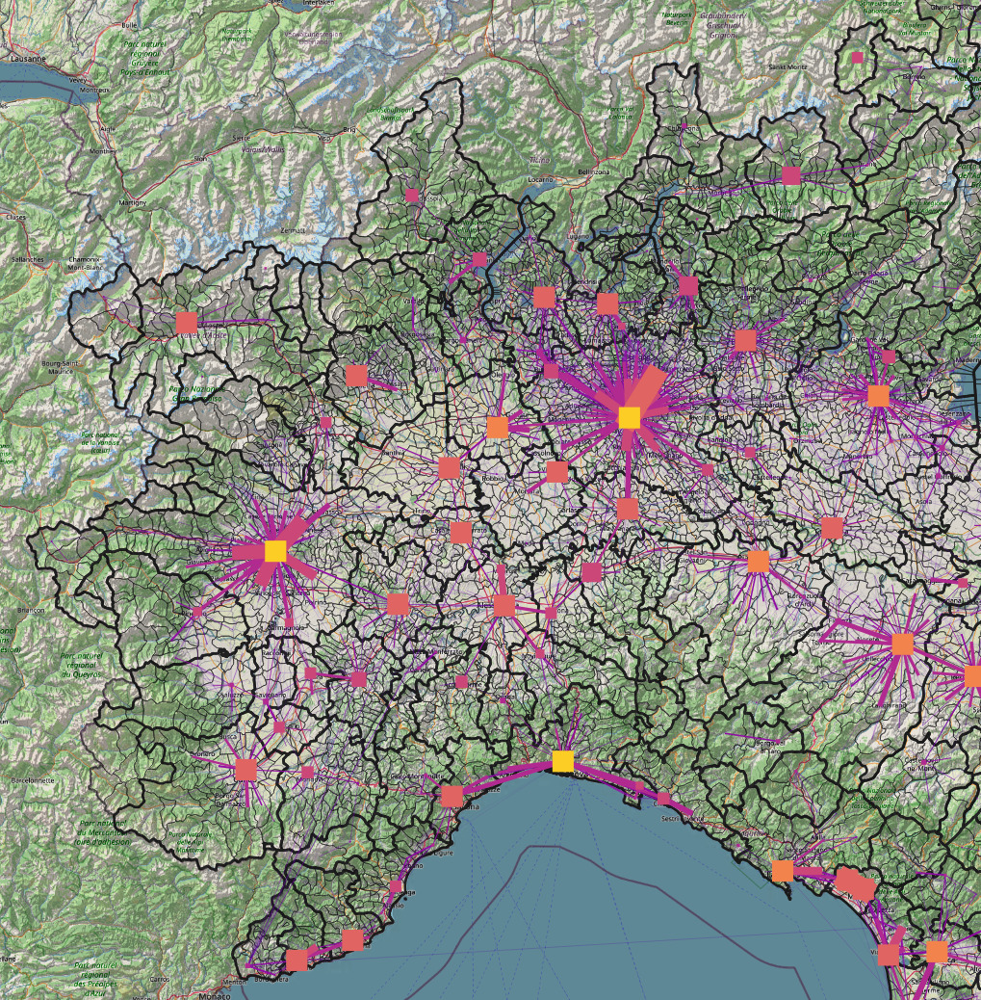
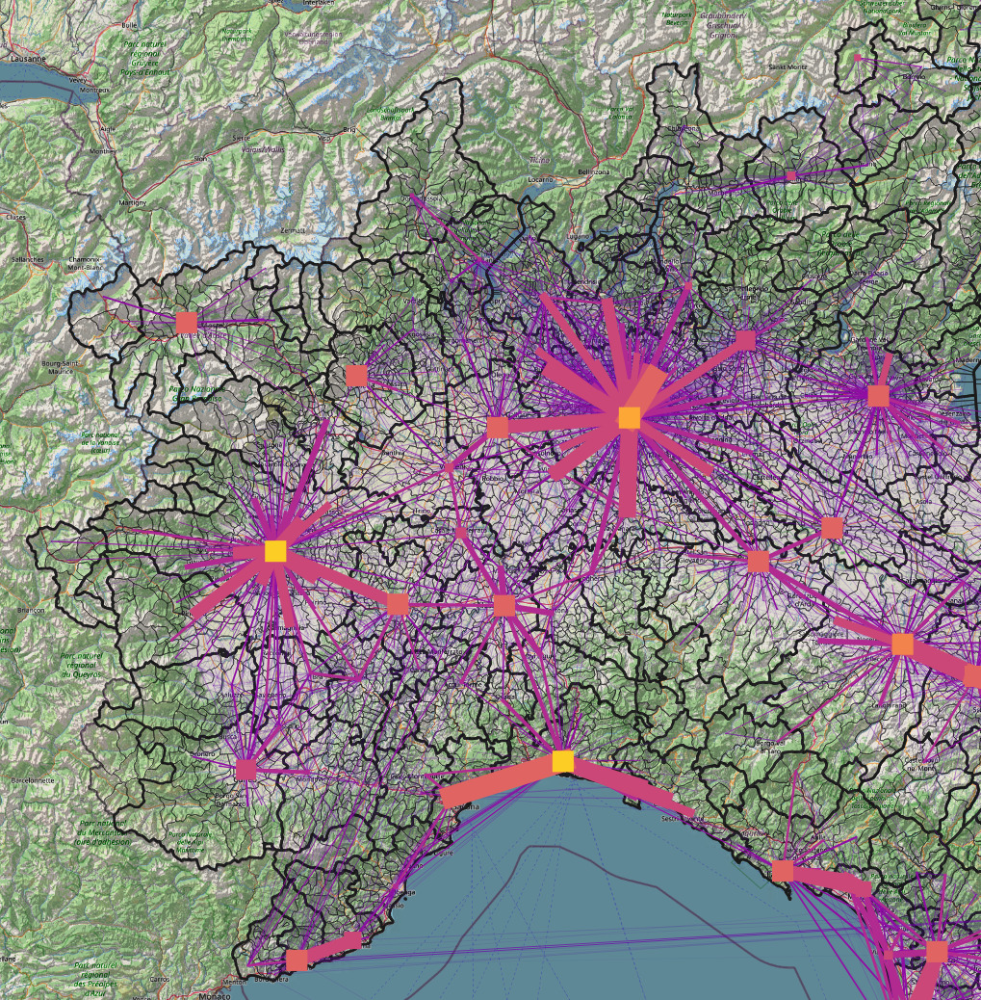
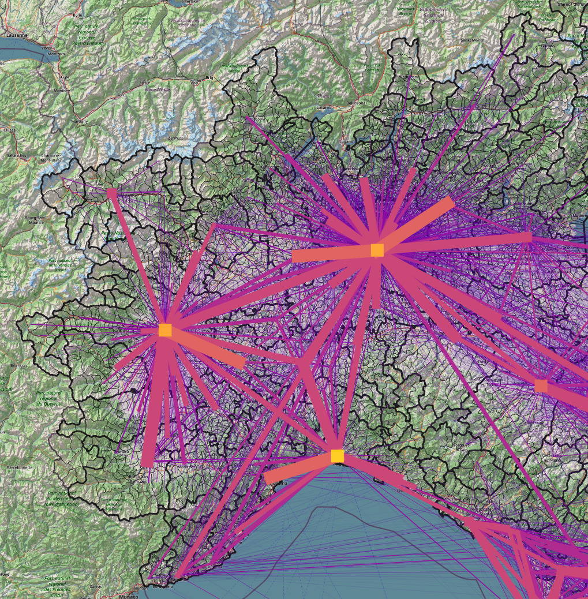
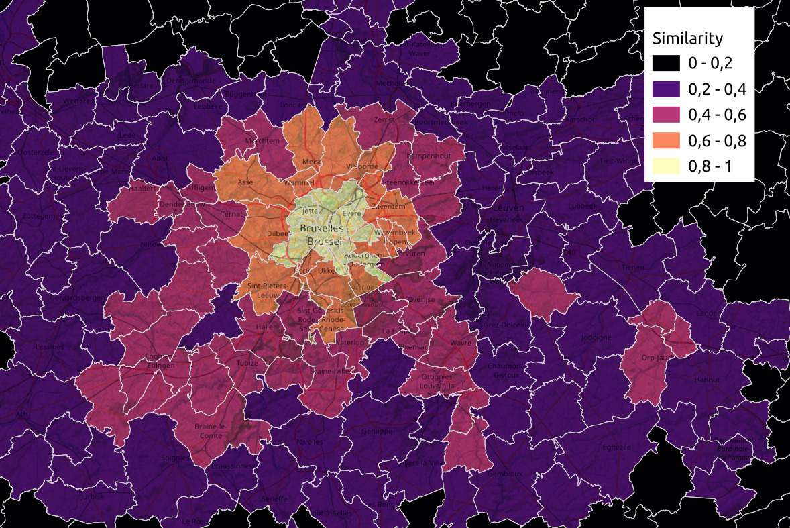
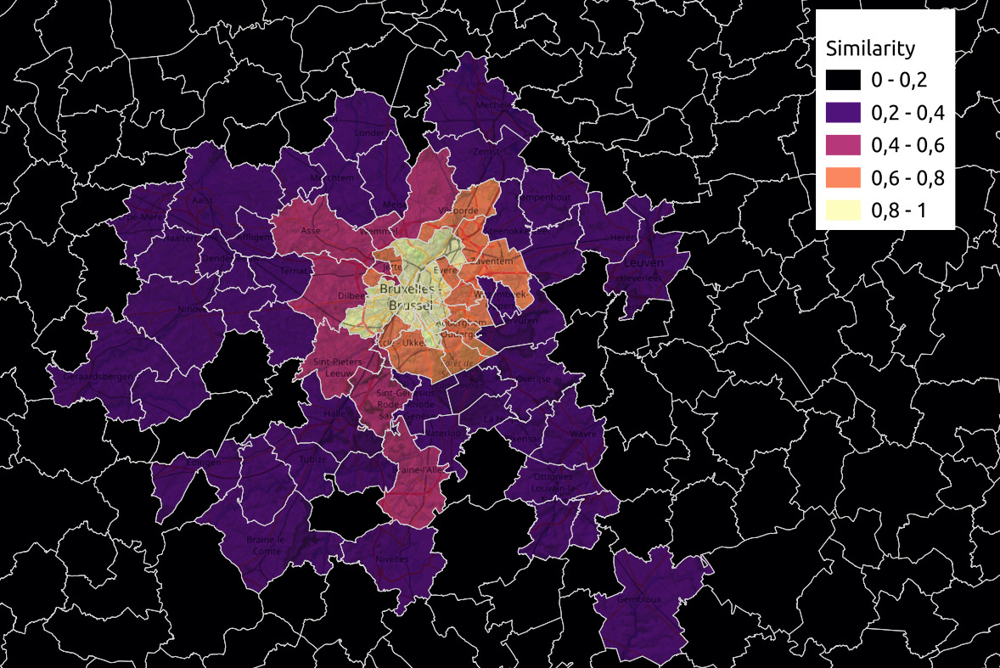

<p align="center">
  
</p>
<p align="center" style="margin-left:10%;margin-right:10%;">
  <i>Extracted centers of levels 10 and 7 in Italy. </i>
</p>

Here we go over the details of our algorithm. We first define the concepts used in our model and the rationale for using them. A detailed walkthrough of the algorithm is then provided, with a pseudo-code implementation of the core centres extraction loop.


- [Definitions](#definitions)
  - [Flow matrix](#flow-matrix)
  - [Node size](#node-size)
  - [Local flows](#local-flows)
  - [Indirect flows](#indirect-flows)
  - [Similarity matrix](#similarity-matrix)
- [Algorithm overview](#algorithm-overview)

## Definitions

### Flow matrix

The input to our method is a flow matrix $F \in \mathbb{R}^{n \times n}$. Every row corresponds to the outgoing flows from a given node: $F_{ij}$ thus represents the number of commuters moving from node $i$ to node $j$. Due to the low interconnectedness between flows not belonging to the same system, $F$ can be expected to be sparse. Although not a strict requirement, we consider $F$ to be symmetric.

Our algorithm relies on various processing methods of $F$, which are used to extract or highlight features from it. The main relevant concepts are defined below.

### Node size

The size $s_i$ of node $i$ is given by its degree, that is the total amount of incoming flows to that node, itself included:

```math
s_i = \sum^{n}_{k}{F_{ik}}
```

### Local flows

All flows are not equal. A certain quantity of people moving between two large nodes does not have the same significance as the same quantity moving between two small nodes. We represent this notion by weighting the flow by a measure of their relative significance. These weights are defined as the inverse distance in a Newtonian gravity model, which compares the flow between $i$ and $j$ to the average size of these two nodes:

```math
\frac{1}{d_{ij}} = \frac{F_{ij}}{\sqrt{s_i s_j}}
```

This factor will produce low values in case of flows that are small relative to the nodes they connect, which can happen for example in the case of commuter flows between two large cities. While such flows can be large in absolute numbers, they are typically small relative to the total number of commuters in each urban region, leading to a small significance. Conversely, $\frac{1}{d_{ij}}$ will reach larger values when the flow between two nodes is large compared to their sizes.

We use this weight definition to create the weighted flow matrix $L$:

```math
L_{ij} = 
\begin{cases} 
\frac{F_ij}{d_ij} \text{ if } F_{ij} >= 0\\
0 \text{ otherwise}
\end{cases}
```

Since a node's neighbourhood is most likely to be its main zone of exchange and to contain nodes similar to it in size, the flows in $L$ have a tendency to highlight the immediate surroundings of a node, while reducing the amplitude of far-away nodes. For this reason, we refer to $L$ as the matrix of **local flows**.

<p align="center">
  
  
</p>
<p align="center" style="margin-left:10%;margin-right:10%;">
  <i>Direct (left) and local flows (right) in the Seine basin region, coloured and scaled according to their magnitude. In this region dominated by the Paris metropolitan area, direct flows only highlight commutes towards Paris and the other cities in the region. On the other hand, local flows uncover a large number of local networks, from secondary centres of larger cities to smaller or more rural settlements.</i>
</p>

### Indirect flows

While two nodes might not directly interact with one another, they might interact with their respective surroundings. In the context of urban regions, this means that both nodes interact with each other's larger commuting systems, thus creating an implicit connection between them. This notion is particularly important in the context of high node granularity, which tends to increase this phenomenon due to higher fragmentation of the urban regions. We represent these implicit flows through the definition of **indirect flows**.

The intuition behind indirect flows is to distribute a node's own outgoing flows across the outgoing flows of its target nodes. Consider a node B producing commuter flows of 2, 3 and 5 to nodes A, B and C respectively. Every individual commuter sent to B can be seen as indirectly spreading to 0.2 for A, 0.3 for B and 0.5 for C. This indirect distribution corresponds to the l1-normalization of $F$'s rows. As such, the total indirect flows of a node are obtained by multiplying these indirect distribution vectors by the amount of commuters sent to each node, and by summing these weighted vectors together.

Therefore, for a given flow matrix $F$, the indirect flows matrix $T$ is given by:

```math
T = F \hat{F}
```

where $\hat{F}$ contains the $l1$-normalized rows of $F$. Since $T$ also represents a flow matrix, the operation of extracting indirect flows from it can be repeated in the same manner. We refer to the number of times this operation has been conducted as the **degree** of the indirect flows. $T_n$ is thus the n-th indirect flows matrix of $F$, and is given by:

```math
T_n = T_{n-1} \hat{T_{n-1}}
```

with the special case of $T_0 = F$.

Using higher-degree indirect flows emphasizes the relationships between larger commuting regions, while diminishing the impact of local flows (see [figure below](#indirect_flows)).

<a id="indirect_flows"></a>
<p align="center">
  
  
  
</p>

<p align="center" style="margin-left:10%;margin-right:10%;">
  <i>Indirect local flows of level 4, 7, and 10, in Northwestern Italy. Flows of a lower level highlight many smaller centers of activity and their immediate surroundings, while higher levels heigten the interconnectivity between larger nodes and their commuting region.</i>
</p>

### Similarity matrix

Our algorithm relies on a normalized measure of similarity between every node pair. The method we use is cosine similarity, which works by computing for every pair of nodes the dot product of their l2-normalized flows. The similarity of two nodes is thus computed by comparing the similarity of their commuting structure: nodes commuting to the same nodes in similar proportions will exhibit similarity scores close to 1, while nodes sharing little to no partners or commuting there in very different proportions will have similarities closer to zero. 

Since the magnitude is not taken into account in the computation of this score, nodes of very different sizes can still be compared favourably if their commuting structure is similar. This is a desirable property, given that nodes such as administrative units can have very different sizes, and thus commute in equally different magnitudes.

We define the similarity matrix of $F$ as 

```math
S = N  N^T
```

where $N$ contains the l2-normalized rows of $F$.

## Algorithm overview

The algorithm starts with every node as its own centre. At each step, an affinity matrix between every node is computed, to quantify the potential of merging a node with another. If a node has a higher affinity value with a node other than itself, it will get merged with it. These merges lead to the creation of new, "centre" nodes: once nodes have been merged together, they are considered as one single node, whose flows are equal to the sum of all its constituent nodes. This continues until that centre node itself gets merged with another node. 

Every step computes a new affinity matrix based on the last assignment produced, potentially resulting in new node mergers at every step. The merging potential is computed using two matrices:

 - A matrix of indirect local flows, whose degree is equal to that of the highest computed assignment level so far. In the first steps, the indirect local flows matrix will have a low degree. As such, the values it contains will be close to the local flows, putting a strong emphasis on the node itself and its immediate surroundings. As the degree of the flows increases, the flows' emphasis will shift towards larger local centres, cities, and metropolises, and typically culminate in large regional exchange networks. 

 - A similarity matrix of the local inverse distances. Inverse distances are only high for nodes exchanging most significantly with each other; as a result, the similarities between these inverse distances are meaningful primarily for nodes that are part of the same local system. Therefore, the similarity vector can be seen as a representation of the local system to which a node belongs, with nodes that are highly similar also being strongly integrated into the same flow patterns. See [the figure below](#similarity) for a comparison of flows and inverse distances similarities.

<a id="similarity"></a>
<p align="center" >
  
  
</p>
<p align="center" style="margin-left:10%;margin-right:10%;">
  <i>Flows similarities (left) and inverse distance similarities (right) of the city of Brussels, with communes in its urban region. Similarities based on flows are overall higher, measuring particularly favourably in the general Brussels region. On the other hand, local similarities are more discriminatory, highlighting mostly the immediate vicinity of the municipality and its main partners.</i>
</p>


At step $n$, nodes belonging to the same centres are merged together, forming a new system of flows between centre nodes. The local similarity matrix $S$ and the matrix of local indirect flows of degree $n-1$, $T_{n-1}$, are computed on that new system. As $n$ grows, $T_{n-1}$ will steer the focus of nodes away from their local systems and towards larger regional ones. Since the rows $S$ serve as a descriptor of a node's local system, it can be used in conjunction with $T_{n-1}$ to determine for each node which local system it belongs to best, according to its indirect flows.

We use that notion to compute the affinity matrix $A_n$ as 

```math
A_n = T_{n-1} S
```

The assignment is based on the values inside $A_n$. For each node $i$, the node $j$ it has the highest affinity with is given by $j = \max_{j}{(A_n)_{ij}}$. If $i = j$, the node has the highest affinity with itself and is not merged at this step. Otherwise, $i$ gets merged with $j$. If $i$ was already a centre node, its constituent members get merged in centre node $j$ as well. The assignment thus does not require any target number of clusters and is done completely on the basis of the affinity matrix.

These steps are repeated for the desired number of output levels, which is provided by the user. A full overview of the algorithm can be found [below](#algorithm). The implementation can be found [here](hierarchical_urban_systems/centers_detector/centers_detector.py).

<a id="algorithm"></a>
```python
"""
Input: max_level, the number of assignment levels expected
       flows_matrix, the direct flows matrix of size n x n
Output: leveled_assignments, matrix of size (l+1) x n
"""
leveled_assignments = initializeEmptyMatrix(rows=max_level + 1, cols=n)
leveled_assignments[0] = getAssignmentWithEveryNodeAsCenter(nodes_count=n)

level = 1
while level < max_level:
    assignment_this_level = leveled_assignments[level - 1]
    center_flows = buildCenterFlowsMatrix(
        flows_matrix=flows_matrix, nodes_assignment=assignment_this_level
    )

    inverse_distances_matrix = getInverseDistancesMatrix(center_flows)
    similarity_matrix = getSimilarityMatrix(inverse_distances_matrix)

    local_flows = getLocalFlows(center_flows)
    indirect_flows = getIndirectFlowsMatrix(flows=local_flows, target_level=level - 1)

    affinity_matrix = matrixProduct(indirect_flows, similarity_matrix)

    leveled_assignments[level] = getNodeAssignmentFromAffinityMatrix(affinity_matrix)
    level = level + 1

return leveled_assignments
```